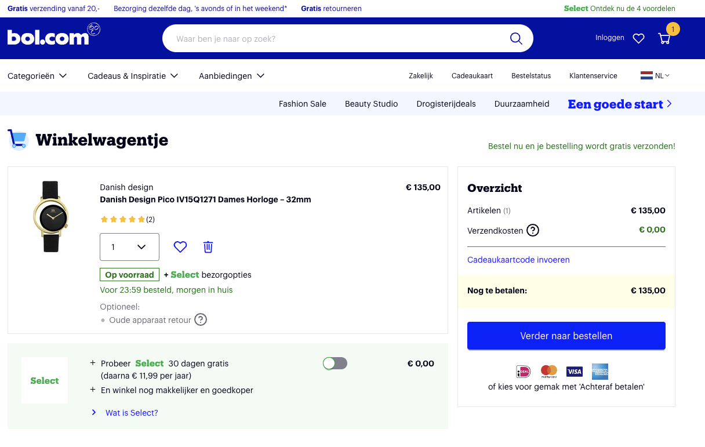

# Full-Proof Testing: A Guide To Predicable Application

## Why

Nice to see you! I am Illia. 

Long time ago, I was working as a freelancer. During that time, I didn't know yet what testing is.

When I was finishing my project, I was sending it to the client. I rested few days, while he was searching the bugs for me. Then I fiercely fought with them. There was no end to them. The longer I fought, the more bugs were appearing. Some of them became already familiar to me, I remembered that I have killed them already before.

Then, I discovered E2E testing. It was a breathe of the air. I would set test to look closely if main functionality of the project is still working. And each time I killed a bug, I set new test, to watch for his re-appearence. Amount of bugs decreased, they became easier to fight. And they stopped coming back. My client was happy. But as the project growed, E2E tests became a heavy burden. Their slow nature and big demands dragged me down. Each time I made small changes to the project, I had to wait for hours. I also had to always run a copy of the backend, and maintain complex system on my laptop.

I decided that this was enough for me. My first step was to remove the backend from my tests. I replaced it with mock server, and as a result, I got Functional tests. Now they were testing most of the functionality of my application, and E2E tests were guarding only the connection to the backend. It made the testing system simpler, and saved me several hours each time I introduced changes.

But I wanted more! It was not enough for me So I started writting unit tests. I was settings small tests everywhere in the code, and bugs didn't have any place to hide. Those tests were extremely fast and didn't eat much. I was still using Functional and E2E tests to ensure that the integration between parts of the application and external services is still working as expected. Now, I was able to catch most of the bugs in minutes, and the most evasive ones were caught less than in ten minutes.

## Me and IDeal

Currently I am working on iDeal as a frontend developer in ABN Amro. Our testing system became even more advanced, and having her in place allows me to sleep peacefully at night.

## Plan for the session

During following 20 minutes I will:

`List item #1 - Testing pyramid` - Then I will speak about Testing Pyramid, the logic behind it, and will briefly cover other testing methods.  

`List item #2 - Types of tests` - I will cover shortly most used types of tests, and explain why and when you might want to use them.

`List item #3 - Traceability matrix` - I will explain what is Traceability Matrix and how it helps you to gain confidence in your tests.

`List item #4 - Unit tests`

`List item #5 - Functional tests`

`List item #6 - E2E tests` - I will cover in depth difference between Unit, Functional and E2E tests, and provide examples.

`List item #7 - Integration with pipeline` - After that I will speak about the importance of integrating tests with the pipeline.

`List item #8 - Breaking the tests` - I will explain how breaking the tests helps you to make them stronger.

`List item #9 - Test Driven Development` - I will cover Test Driven Development, and show with example how it makes tests human readable.

`List item #10 - Questions` - After that I will be open to questions or maybe suggestions.

## Types of tests

There are multiple species of bugs. And to catch them all, you need different weapons. Let me tell you about them.

- **Unit tests** - are testing pieces of code separately from each other
- **Functional tests** - are testing your whole application in isolation from external services
- **E2E tests** - are focusing on integration between your application and external services
- **Accessibility tests** check for common problems that may make it difficult for users with disabilities to use your website.
- **Performance tests** will explain you how much time user will take to load the page, how bad network will affect his experience, and what is the load on his processor
- **Mutation tests** will randomly generate bugs in your code to check your tests can spot them. Basically they test your tests.
- **Contract tests** are checking that agreement between your frontend and backend is still correct.
- **Memory leakage tests** as the name suggests helps you to find memory leaks in your application. If expected session time of your users is long, that is something you definitely want to test for.
- **Snapshots tests** compares confirmed html output with new version. Helps you spot unexpected UI changes.
- **Security tests** checks your code for vulnerabilities.
- **Code quality tests** helps you to ensure same code style withing a team or organisation. Also shows you common mistakes and problems in your codebase.

## Testing methods

Weapons are useless if you don't use them properly. Let me tell you about some handy approaches:

- **Testing pyramid**
- **Traceability matrix**
- **Test driven development**
- **Breaking the tests**
- **Integration with the pipeline**

## Testing Pyramid

As my story told, tests can be quite expensive. You have to use them sparingly.

I would start with static tests. It is an one time investment. Once you setup them, they will give you advices during whole life of your application.

Unit tests are fastest and least demanding. Don't be greedy with them.

If unit tests didn't help, use Functional. They are here to ensure correct communication between parts of your application.

And E2E tests will let you know that you application is still producing correct result when it connects to the backend. Be careful with them.

As a last resort, if nothing else helps. Add a test case to your manual testing plan. But be prepared to spend a lot of time in a long run.

## Traceability matrix

Before you start to test anything. You should understand what is expected from your application. As you gather all your requirements, you keep track of their testing status using traceability matrix.

More often than not, if you found a bug, you missed some requirement in the initial stage. So each time you find a bug, check the traceability matrix and update it accordingly.

Another advantage of traceability matrix, is that your clients or stackeholders without technical knowledge will be able to read them.

`Traceability matrix`

## Test Driven Development

Egg or chicken question. What should come first? Tests or code. I firmly believe that it is in your best interests to write tests first. They are the direct requirement to your code, and better to let them shape the code, than code shape the tests. This approach will give you human readable tests and will prevent you from writting reduntant code.

I will show it in practice few slides from now.

## Breaking the tests

How do you understand that your tests are stable enough? 

Break the code! Break the application! Introduce unexpected change! Do whatever you can to fool your tests. Introduce the chaos, and see if they can catch it.

Were you not able to do it? Well, then you can trust your tests.

## Integration with pipeline

What if you forget to run your automated tests and deploy untested application to production?

Worry not, because when you include the tests into the pipeline, they will be run automatically.

The pipeline will also automate the deployment to production. Which gives you even more safety and less headache.

## Unit level 

Unit tests are the foundation of your testing strategy. 
They are cheap, fast, inexpensive.
This allows us to cover as much edge cases as we want.

There are multiple tools you can use for that, the list you see on the slide is not exclusive.

`Example of unit level function`

Let's go to the example. Imagine that we have following function, which is calculating the discount based on the price which we have provided.

`List of unit test requiremements`

So what I would expect to test:

- That discount is correctly applied in respective price range. Including edge cases.
- That it throws an error if we provide unexpected parameters.

`Example of modified unit level function that fails`

`Example of modified unit level function that passes`

And now we can safely modify that function without any fear of it breaking. 
Because we know that test will check all functionality of this function each time that we are making any change.

## Functional level

While unit tests are focusing on a piece of the code, functional tests are checking your whole application. 

To make an example, let's imagine that we have a webshop. 
You should have already covered all the edge cases in your unit tests.

And now we just want to see that integration of all those pieces of the code, which makes your application, are working fine.

We want to focus on our application at this moment, so we mock API calls. 

I would write several tests to prove that integration between those components works:

- **Happy flow:** User can login, add product to the basket, complete checkout, pays and see success payment page.
- **Error login flow:** When user logins, error message should appear if backend fails with an error and user should be stopped.
- **Basket failure flow:** When user adds product to busket, error message should appear if backend fails with an error and user should be able to try again.
- **Checkout failture flow:** When user submits checkout form, error message should appear if backend fails with an error and user should be able to try again.
- **Payment failure flow:** When user tries to pay, error message should appear if he doesn't have enough money.

## E2E level

Finally, we have to be sure that our application is successfully integrated with API, and whole system is working properly together. 
This is the most expensive, but absolutely necessary part of our testing strategy.

In our example from above, we would have to test only HappyFlow, since login page till SuccessScreen. 

It will prove that connection between all the parties is estabilished.

## Functional and E2E level

You can use same tools and write same tests for functional and e2e level. The only difference is what you test.

## QA time

Thank you for your attention. I will now open the floor for a Q&A session. If you think of questions later or want a deeper discussion, I will be around for the entirety of the meetup, so please feel free to approach me. Additionally, I will be posting slides of this presentation in the meetup comments for reference. If you'd like to connect or discuss further, I will also share my LinkedIn profilethere. Looking forward to your questions and further interractions.